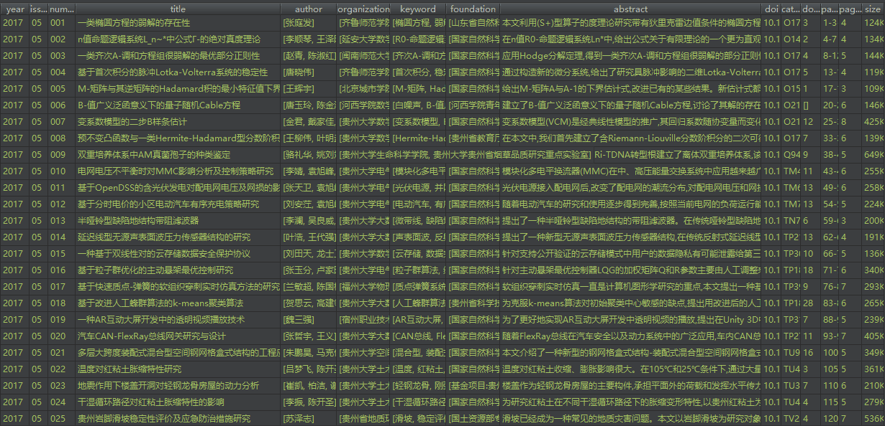

# Cnki Spider

This is a cnki-spider based on requests and beautifulsoup python-libs.
It aims crawling a certain magazine, GZU Journal(Natural Science), for instance.

## Notice

- It does not provide a magazine free-download url, but a list of paper information. 
- We do not take the _Call of Papers_ and the _Conferences News_ included 

## Contact

If there are something wrong or bugs and advice, feel free to post an issue, or email to me: `spico1026@gmail.com`.
You can contribute your codes to the `dev` branch. Welcome to do such a program together~

## TODO

- Data mining and analysis
- PySide/PyQt GUI program
- Developing by using Scrapy and spider managers, and distributed crawlers
 